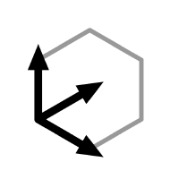

   

<h1 align="center">
Basis
</h1>

Basis is a robotics development framework developed by [Basis Robotics](https://basisrobotics.tech/), designed to accelerate your journey from concept to prototype, while maintaining a focus on both testing and production.

<!--  TODO: confirm links -->
[Quick start](https://docs.basisrobotics.tech/quistart)
&nbsp;&nbsp;·&nbsp;&nbsp;
[Documentation](https://docs.basisrobotics.tech)
&nbsp;&nbsp;·&nbsp;&nbsp;
[Examples](https://docs.basisrobotics.tech/examples)

[Discord](https://www.discord.com/TODO)
&nbsp;&nbsp;·&nbsp;&nbsp;
[Blog](https://basisrobotics.tech/blog/)
&nbsp;&nbsp;·&nbsp;&nbsp;
[LinkedIn](https://www.linkedin.com/company/basisrobotics/)

Start a new project by following our [documentation](https://docs.basisrobotics.tech). We would love to hear from you! If you have any feedback or run into issues using our framework, please file an [issue](https://github.com/basis-robotics/basis/issues/new) on this repository.

## Why Basis?

- **Rapid Experimentation and Iteration**: Easily experiment and iterate, speeding up your development process from concept to prototype, and from prototype to production.
- **Code Generator for Boilerplate**: Ensure your applications meet the highest standards with Basis' code generator, which creates boilerplate code to help avoid mistakes, allowing you to focus on your core logic rather than plumbing the architecture.
- **Customizable Message Transport**: Serialization and message transport are handled through plugins, enabling customization to meet project needs. Current support includes ROS and Protocol Buffers, with more options coming soon.
- **Minimal Dependencies**: Basis minimizes external dependencies, simplifying OS upgrades and package updates, and resulting in smaller symbol files and reduced link times.
- **Testing Support**: Run sub-system testing and integration testing easily in your CI pipeline.
- **Deterministic Replay**: Guarantee consistent execution with deterministic replay, ensuring reproducible tests that you can confidently trust.

Whether you're in the prototyping stage or ready for production, Basis provides the tools and flexibility you need to build reliable robotics applications.

